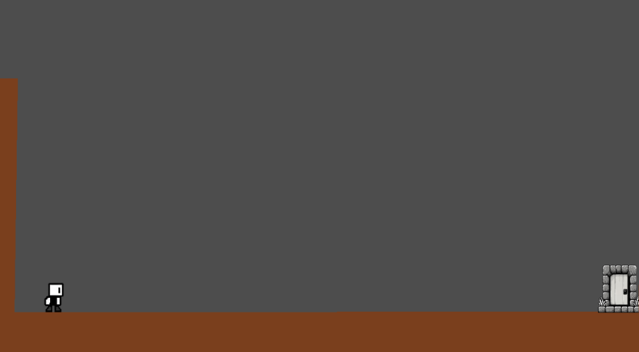
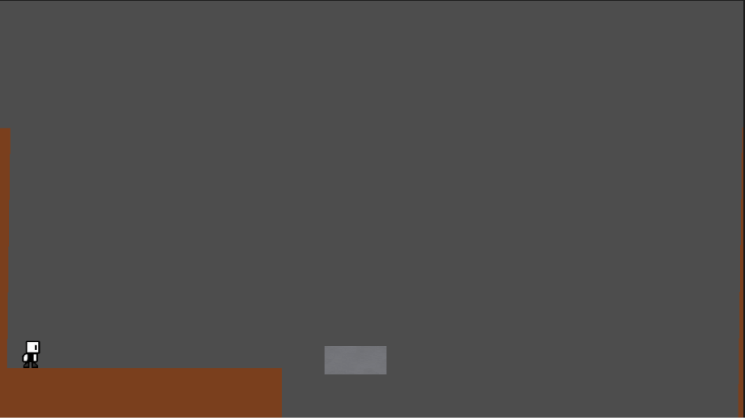
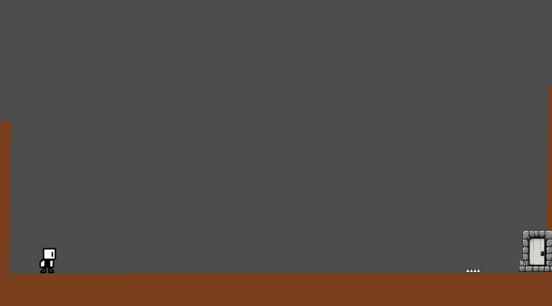
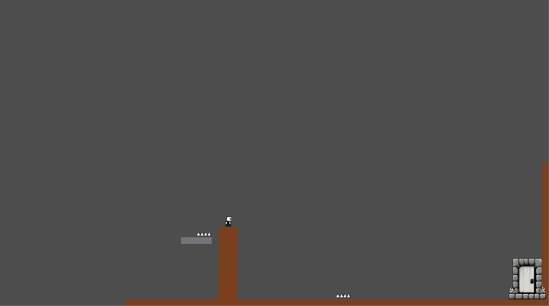
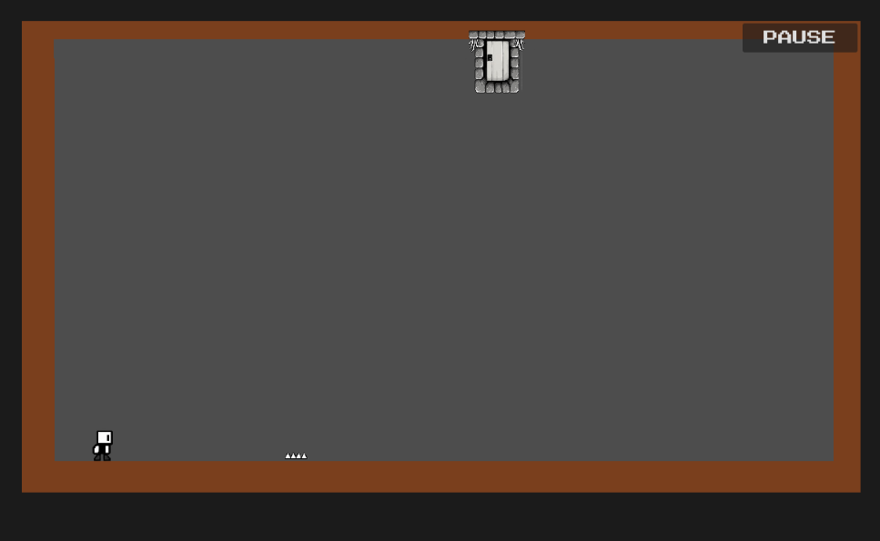
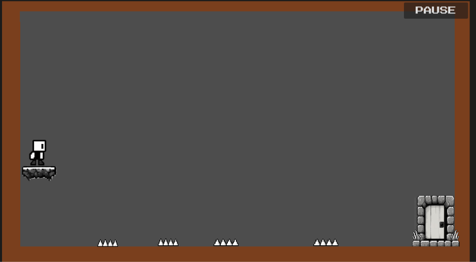
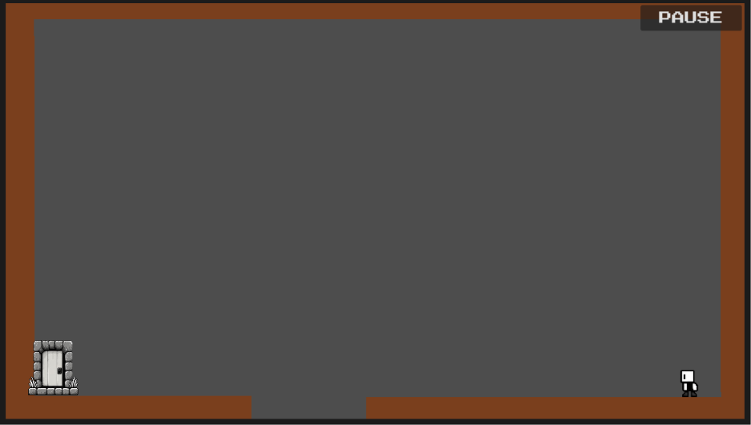
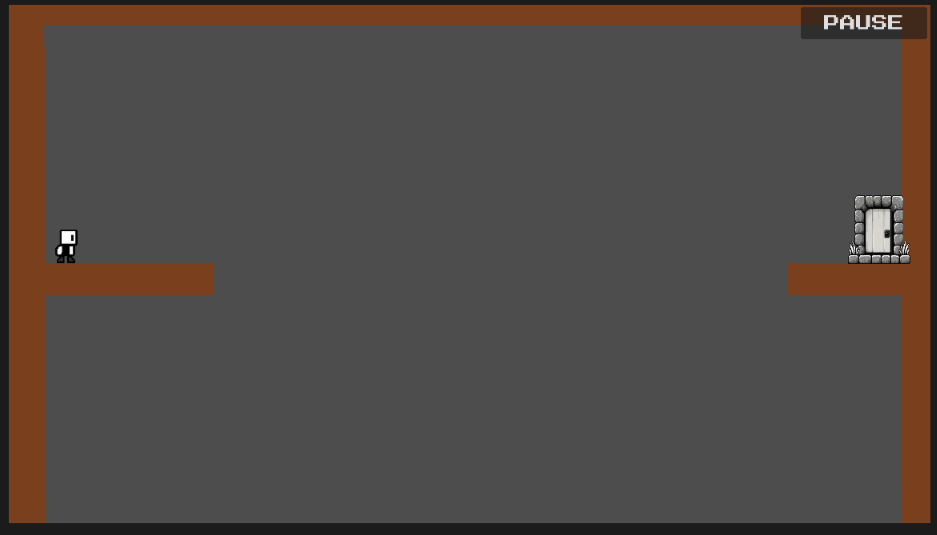

# Trollbound

Trollbound is a level-devil-inspired, short, trap-filled 2D platformer built in **Godot 4** for the **Stardance Challenge**.

The goal is simple: Reach the door, but the levels do not allow you to do that easily.

## Controls

1. Move left - Left Arrow key
2. Move right - Right Arrow key
3. Jump- Space Bar / Enter

## Features

- Game developed in 2D
- Trap-filled and addictive
- Unexpected challenges
- Sound Effects
- Music in levels and main menu
- Settings to manage music
- persistent game play (i.e your progress will survive the restart)

## Why I made this

I made this as part of the Stardance challenge and I want to know how game development works.

## How I made this

I made this using Godot 4

I first created the scenes of the player, traps, ground, etc...
Then I made level scenes and then I correctly placed the asset scenes into level scenes to make it actually look like a game

## What I Learned

While making Trollbound, I learned about:

- Godot 4 scenes and nodes
- 2D player movement
- Collision detection
- Creating and managing game assets
- Designing traps and challenges
- Organizing a complete Godot project

## Screenshots

| Level 1 | Level 2 |
| :---: | :---: |
|  |  |

| Level 3 | Level 4 |
| :---: | :---: |
|  |  |

| Level 5 | Level 6 |
| :---: | :---: |
|  |  |

| Level 7 | Level 8 |
| :---: | :---: |
|  |  |

---
